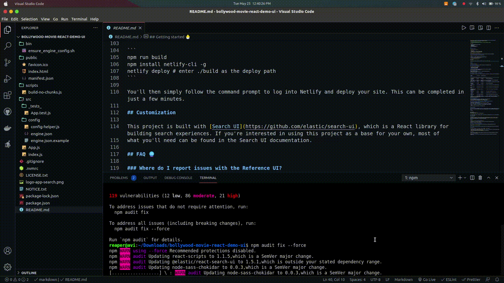

<p align="center"></p>

> A configurable, generic search UI for any [Elastic App Search](https://www.elastic.co/products/app-search) Engine.

## Getting started 🐣

The Reference UI is great for:

- search demos
- functional tests of App Search Engine data
- a starting point for new search experiences

Requires [npm](https://www.npmjs.com/).

Run the following commands to start this application:

```bash
# Run the `cd` command to change the current directory to the
# location of your downloaded Reference UI. Replace the path
# below with the actual path of your project.
cd ~/Downloads/app-search-reference-ui

# Run this to set everything up
npm install
```



```bash
# Run this to start your application and open it up in a new browser window
npm start
```


## Deploy and Share

This app can be easily published to any server as static assets and served. We recommend [Netlify](https://www.netlify.com/), but you have other [options](https://facebook.github.io/create-react-app/docs/deployment) as well.

To deploy:

```
npm run build
npm install netlify-cli -g
netlify deploy # enter ./build as the deploy path
```

You'll then simply follow the command prompt to log into Netlify and deploy your site. This can be completed in just a few minutes.

## Customization

This project is built with [Search UI](https://github.com/elastic/search-ui), which is a React library for building search experiences. If you're interested in using this project as a base for your own, most of
what you'll need can be found in the Search UI documentation.

### Where can I learn more about App Search?

Your best bet is to read the [documentation](https://www.elastic.co/guide/en/app-search/current).

### Where else can I go to get help?

You can checkout the [Elastic App Search community discuss forums](https://discuss.elastic.co/c/app-search).

## License 📗

[Apache-2.0](https://github.com/elastic/app-search-reference-ui-react/blob/master/LICENSE.md) © [Elastic](https://github.com/elastic)

Thank you to all for visiting!
